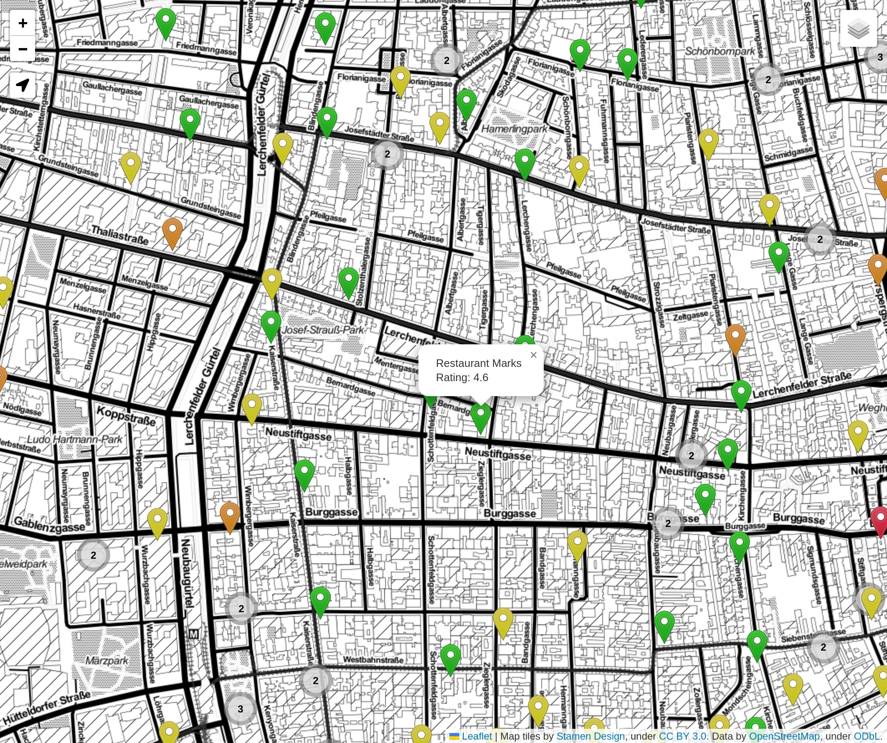

# Mahlzeit!

Sodexo Restaurant Gutscheine Acceptance + Google Maps ratings shown on a map.

## Screenshot



## Run

1. Create and activate a virtual environment
    ```
    python -m venv venv
    source venv/bin/activate
    ```
2. Install dependencies
    ```
    pip install -r requirements.txt
    ```
3. Set the the environment variable `MAPS_API_KEY` to a valid Google Maps API key e.g. via a `.env` file.
4. Run the scraper with default parameters `python scrape.py` or get a help message about the parameters `python scrape.py --h`
5. Open index.html in a browser


## Live

https://mahlzeit.sad.bz